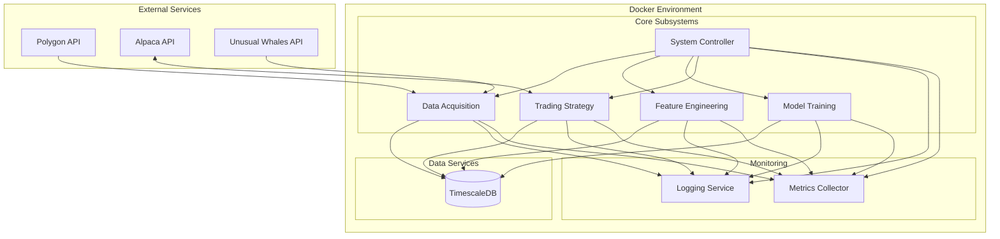

# Production Containerization Strategy for Autonomous Trading System

## Overview

This document outlines a comprehensive containerization strategy for the Autonomous Trading System in a production environment. The strategy focuses on maximum flexibility, allowing each component to be deployed, scaled, and updated independently.

## Containerization Architecture



## Directory Structure for Production Deployment

```
autonomous_trading_system/
├── .env                           # Base environment variables
├── docker-compose.yml             # Main Docker Compose configuration
├── docker-compose.override.yml    # Environment-specific overrides
├── config/                        # Configuration files
│   ├── logging.yaml               # Logging configuration
│   ├── market_hours.json          # Market hours configuration
│   ├── feature_config.json        # Feature engineering configuration
│   └── model_config.json          # Model training configuration
├── docker/                        # Docker-related files
│   ├── base/                      # Base Docker image
│   │   └── Dockerfile             # Base Dockerfile
│   ├── system_controller/         # System Controller Docker files
│   │   ├── Dockerfile             # System Controller Dockerfile
│   │   └── start.sh               # System Controller startup script
│   ├── data_acquisition/          # Data Acquisition Docker files
│   │   ├── Dockerfile             # Data Acquisition Dockerfile
│   │   └── start.sh               # Data Acquisition startup script
│   ├── feature_engineering/       # Feature Engineering Docker files
│   │   ├── Dockerfile             # Feature Engineering Dockerfile
│   │   └── start.sh               # Feature Engineering startup script
│   ├── model_training/            # Model Training Docker files
│   │   ├── Dockerfile             # Model Training Dockerfile
│   │   └── start.sh               # Model Training startup script
│   ├── trading_strategy/          # Trading Strategy Docker files
│   │   ├── Dockerfile             # Trading Strategy Dockerfile
│   │   └── start.sh               # Trading Strategy startup script
│   └── timescaledb/               # TimescaleDB Docker files
│       └── init/                  # TimescaleDB initialization scripts
│           └── init.sql           # Database initialization SQL
├── scripts/                       # Management scripts
│   ├── start_system.sh            # System startup script
│   ├── stop_system.sh             # System shutdown script
│   ├── system_status.sh           # System status script
│   ├── backup_database.sh         # Database backup script
│   └── backup_models.sh           # Model backup script
└── src/                           # Source code (as in current structure)
    ├── backtesting/
    ├── continuous_learning/
    ├── data_acquisition/
    ├── feature_engineering/
    ├── model_training/
    ├── tests/
    ├── trading_strategy/
    └── utils/
```

## Component-Specific Dockerfiles

### 1. Base Image Dockerfile

```dockerfile
# File: autonomous_trading_system/docker/base/Dockerfile

# Base image with NVIDIA CUDA support
FROM nvcr.io/nvidia/tensorflow:24.02-tf2-py3

# Set up environment variables
ENV PYTHONUNBUFFERED=1 \
    PYTHONDONTWRITEBYTECODE=1 \
    TZ=UTC \
    DEBIAN_FRONTEND=noninteractive

# Install system dependencies
RUN apt-get update && apt-get install -y --no-install-recommends \
    postgresql-client \
    tzdata \
    curl \
    ca-certificates \
    && rm -rf /var/lib/apt/lists/*

# Set up Python environment
RUN pip install --no-cache-dir --upgrade pip \
    && pip install --no-cache-dir \
    psycopg2-binary \
    pandas \
    pytz \
    requests \
    sqlalchemy \
    numpy

# Create app directory
WORKDIR /app

# Create non-root user
RUN groupadd -g 1000 appuser && \
    useradd -r -u 1000 -g appuser appuser && \
    chown -R appuser:appuser /app

# Switch to non-root user
USER appuser

# Set default command
CMD ["python", "-c", "import sys; print('Container is ready to use.')"]
```

### 2. System Controller Dockerfile

```dockerfile
# File: autonomous_trading_system/docker/system_controller/Dockerfile

FROM autonomous_trading_system/base:latest

# Install specific dependencies
RUN pip install --no-cache-dir \
    pyyaml \
    schedule \
    prometheus_client

# Copy application code
COPY --chown=appuser:appuser src/config /app/src/config
COPY --chown=appuser:appuser src/utils /app/src/utils
COPY --chown=appuser:appuser src/tests/system_components.py /app/src/system_controller/system_components.py

# Copy startup script
COPY --chown=appuser:appuser docker/system_controller/start.sh /app/start.sh
RUN chmod +x /app/start.sh

# Set entry point
ENTRYPOINT ["/app/start.sh"]
```

### 3. Data Acquisition Dockerfile

```dockerfile
# File: autonomous_trading_system/docker/data_acquisition/Dockerfile

FROM autonomous_trading_system/base:latest

# Install specific dependencies
RUN pip install --no-cache-dir \
    websocket-client \
    polygon-api-client \
    alpaca-trade-api \
    aiohttp \
    asyncio

# Copy application code
COPY --chown=appuser:appuser src/config /app/src/config
COPY --chown=appuser:appuser src/utils /app/src/utils
COPY --chown=appuser:appuser src/data_acquisition /app/src/data_acquisition

# Copy startup script
COPY --chown=appuser:appuser docker/data_acquisition/start.sh /app/start.sh
RUN chmod +x /app/start.sh

# Set entry point
ENTRYPOINT ["/app/start.sh"]
```

### 4. Feature Engineering Dockerfile

```dockerfile
# File: autonomous_trading_system/docker/feature_engineering/Dockerfile

FROM autonomous_trading_system/base:latest

# Install specific dependencies
RUN pip install --no-cache-dir \
    ta-lib \
    scikit-learn \
    statsmodels \
    numba

# Copy application code
COPY --chown=appuser:appuser src/config /app/src/config
COPY --chown=appuser:appuser src/utils /app/src/utils
COPY --chown=appuser:appuser src/feature_engineering /app/src/feature_engineering

# Copy startup script
COPY --chown=appuser:appuser docker/feature_engineering/start.sh /app/start.sh
RUN chmod +x /app/start.sh

# Set entry point
ENTRYPOINT ["/app/start.sh"]
```

### 5. Model Training Dockerfile

```dockerfile
# File: autonomous_trading_system/docker/model_training/Dockerfile

FROM autonomous_trading_system/base:latest

# Install specific dependencies
RUN pip install --no-cache-dir \
    xgboost \
    scikit-learn \
    optuna \
    joblib \
    tensorflow-tensorrt \
    tensorflow-serving-api \
    torch \
    torchvision

# Copy application code
COPY --chown=appuser:appuser src/config /app/src/config
COPY --chown=appuser:appuser src/utils /app/src/utils
COPY --chown=appuser:appuser src/model_training /app/src/model_training

# Set up TensorRT integration
ENV TF_TRT_ENABLE=1 \
    TF_XLA_FLAGS="--tf_xla_auto_jit=2 --tf_xla_cpu_global_jit"

# Copy startup script
COPY --chown=appuser:appuser docker/model_training/start.sh /app/start.sh
RUN chmod +x /app/start.sh

# Set entry point
ENTRYPOINT ["/app/start.sh"]
```

### 6. Trading Strategy Dockerfile

```dockerfile
# File: autonomous_trading_system/docker/trading_strategy/Dockerfile

FROM autonomous_trading_system/base:latest

# Install specific dependencies
RUN pip install --no-cache-dir \
    alpaca-trade-api \
    ccxt \
    redis

# Copy application code
COPY --chown=appuser:appuser src/config /app/src/config
COPY --chown=appuser:appuser src/utils /app/src/utils
COPY --chown=appuser:appuser src/trading_strategy /app/src/trading_strategy

# Copy startup script
COPY --chown=appuser:appuser docker/trading_strategy/start.sh /app/start.sh
RUN chmod +x /app/start.sh

# Set entry point
ENTRYPOINT ["/app/start.sh"]
```

## Docker Compose Configuration

```yaml
# File: autonomous_trading_system/docker-compose.yml

version: '3.8'

services:
  # Database services
  timescaledb:
    image: timescale/timescaledb:latest-pg14
    ports:
      - "${TIMESCALEDB_PORT}:5432"
    environment:
      - POSTGRES_PASSWORD=${TIMESCALEDB_PASSWORD}
      - POSTGRES_USER=${TIMESCALEDB_USER}
      - POSTGRES_DB=${TIMESCALEDB_DATABASE}
    volumes:
      - timescaledb-data:/var/lib/postgresql/data
      - ./docker/timescaledb/init:/docker-entrypoint-initdb.d
    restart: unless-stopped
    healthcheck:
      test: ["CMD-SHELL", "pg_isready -U ${TIMESCALEDB_USER}"]
      interval: 10s
      timeout: 5s
      retries: 5
    networks:
      - trading_network

  # Core system services
  system-controller:
    build:
      context: .
      dockerfile: docker/system_controller/Dockerfile
    image: autonomous_trading_system/system-controller:${VERSION:-latest}
    depends_on:
      timescaledb:
        condition: service_healthy
    env_file:
      - .env
    volumes:
      - logs:/app/logs
      - ./config:/app/config
    restart: unless-stopped
    networks:
      - trading_network
      - monitoring_network

  data-acquisition:
    build:
      context: .
      dockerfile: docker/data_acquisition/Dockerfile
    image: autonomous_trading_system/data-acquisition:${VERSION:-latest}
    depends_on:
      - system-controller
      - timescaledb
    env_file:
      - .env
    volumes:
      - logs:/app/logs
      - ./config:/app/config
      - data:/app/data
    restart: unless-stopped
    networks:
      - trading_network
      - monitoring_network

  feature-engineering:
    build:
      context: .
      dockerfile: docker/feature_engineering/Dockerfile
    image: autonomous_trading_system/feature-engineering:${VERSION:-latest}
    depends_on:
      - system-controller
      - data-acquisition
    env_file:
      - .env
    volumes:
      - logs:/app/logs
      - ./config:/app/config
      - features:/app/features
    restart: unless-stopped
    networks:
      - trading_network
      - monitoring_network

  model-training:
    build:
      context: .
      dockerfile: docker/model_training/Dockerfile
    image: autonomous_trading_system/model-training:${VERSION:-latest}
    depends_on:
      - system-controller
      - feature-engineering
    env_file:
      - .env
    volumes:
      - logs:/app/logs
      - ./config:/app/config
      - models:/app/models
    deploy:
      resources:
        reservations:
          devices:
            - driver: nvidia
              count: 1
              capabilities: [gpu]
    restart: unless-stopped
    networks:
      - trading_network
      - monitoring_network

  trading-strategy:
    build:
      context: .
      dockerfile: docker/trading_strategy/Dockerfile
    image: autonomous_trading_system/trading-strategy:${VERSION:-latest}
    depends_on:
      - system-controller
      - model-training
    env_file:
      - .env
    volumes:
      - logs:/app/logs
      - ./config:/app/config
    restart: unless-stopped
    networks:
      - trading_network
      - monitoring_network

networks:
  trading_network:
    driver: bridge
    internal: true  # No external access
  monitoring_network:
    driver: bridge

volumes:
  timescaledb-data:
  logs:
  data:
  features:
  models:
```

## Component Startup Scripts

### 1. System Controller Startup Script

```bash
#!/bin/bash
# File: autonomous_trading_system/docker/system_controller/start.sh

# Wait for TimescaleDB to be ready
echo "Waiting for TimescaleDB..."
until PGPASSWORD=$TIMESCALEDB_PASSWORD psql -h $TIMESCALEDB_HOST -U $TIMESCALEDB_USER -d $TIMESCALEDB_DATABASE -c '\q'; do
  echo "TimescaleDB is unavailable - sleeping"
  sleep 1
done

echo "TimescaleDB is up - starting System Controller"

# Start the system controller
python -m src.system_controller.main
```

### 2. Data Acquisition Startup Script

```bash
#!/bin/bash
# File: autonomous_trading_system/docker/data_acquisition/start.sh

# Wait for System Controller to be ready
echo "Waiting for System Controller..."
until curl -s http://system-controller:8000/health > /dev/null; do
  echo "System Controller is unavailable - sleeping"
  sleep 1
done

echo "System Controller is up - starting Data Acquisition"

# Start the data acquisition service
python -m src.data_acquisition.main
```

### 3. Feature Engineering Startup Script

```bash
#!/bin/bash
# File: autonomous_trading_system/docker/feature_engineering/start.sh

# Wait for Data Acquisition to be ready
echo "Waiting for Data Acquisition..."
until curl -s http://data-acquisition:8001/health > /dev/null; do
  echo "Data Acquisition is unavailable - sleeping"
  sleep 1
done

echo "Data Acquisition is up - starting Feature Engineering"

# Start the feature engineering service
python -m src.feature_engineering.main
```

### 4. Model Training Startup Script

```bash
#!/bin/bash
# File: autonomous_trading_system/docker/model_training/start.sh

# Wait for Feature Engineering to be ready
echo "Waiting for Feature Engineering..."
until curl -s http://feature-engineering:8002/health > /dev/null; do
  echo "Feature Engineering is unavailable - sleeping"
  sleep 1
done

echo "Feature Engineering is up - starting Model Training"

# Configure GPU settings if enabled
if [ "$GPU_ENABLED" = "true" ]; then
  echo "GPU is enabled - configuring GPU settings"
  nvidia-smi
fi

# Start the model training service
python -m src.model_training.main
```

### 5. Trading Strategy Startup Script

```bash
#!/bin/bash
# File: autonomous_trading_system/docker/trading_strategy/start.sh

# Wait for Model Training to be ready
echo "Waiting for Model Training..."
until curl -s http://model-training:8003/health > /dev/null; do
  echo "Model Training is unavailable - sleeping"
  sleep 1
done

echo "Model Training is up - starting Trading Strategy"

# Start the trading strategy service
python -m src.trading_strategy.main
```

## System Management Scripts

### 1. System Startup Script

```bash
#!/bin/bash
# File: autonomous_trading_system/scripts/start_system.sh

# Load environment variables
source .env

# Start the system with Docker Compose
docker-compose up -d

# Wait for all services to be healthy
echo "Waiting for all services to be healthy..."
sleep 10

# Check system status
docker-compose ps

echo "System started successfully"
```

### 2. System Shutdown Script

```bash
#!/bin/bash
# File: autonomous_trading_system/scripts/stop_system.sh

# Gracefully stop the system
docker-compose down

echo "System stopped successfully"
```

### 3. System Status Script

```bash
#!/bin/bash
# File: autonomous_trading_system/scripts/system_status.sh

# Check system status
docker-compose ps

# Check logs for errors
echo "Recent errors:"
docker-compose logs --tail=100 | grep -i error

# Check resource usage
echo "Resource usage:"
docker stats --no-stream
```

### 4. Database Backup Script

```bash
#!/bin/bash
# File: autonomous_trading_system/scripts/backup_database.sh

# Load environment variables
source .env

# Set backup parameters
TIMESTAMP=$(date +%Y%m%d_%H%M%S)
BACKUP_DIR="./backups/database"
BACKUP_FILE="timescaledb_backup_${TIMESTAMP}.dump"

# Create backup directory if it doesn't exist
mkdir -p ${BACKUP_DIR}

# Perform backup
echo "Backing up TimescaleDB..."
docker-compose exec -T timescaledb pg_dump -U ${TIMESCALEDB_USER} -d ${TIMESCALEDB_DATABASE} -F c -f /tmp/${BACKUP_FILE}
docker cp $(docker-compose ps -q timescaledb):/tmp/${BACKUP_FILE} ${BACKUP_DIR}/${BACKUP_FILE}

# Check backup status
if [ $? -eq 0 ]; then
  echo "Backup completed successfully: ${BACKUP_FILE}"
  
  # Clean up old backups (keep last 7 days)
  find ${BACKUP_DIR} -name "timescaledb_backup_*.dump" -mtime +7 -delete
else
  echo "Backup failed!"
  exit 1
fi
```

### 5. Model Backup Script

```bash
#!/bin/bash
# File: autonomous_trading_system/scripts/backup_models.sh

# Set backup parameters
TIMESTAMP=$(date +%Y%m%d_%H%M%S)
BACKUP_DIR="./backups/models"
MODEL_VOLUME="autonomous_trading_system_models"

# Create backup directory if it doesn't exist
mkdir -p ${BACKUP_DIR}

# Perform backup
echo "Backing up models..."
docker run --rm -v ${MODEL_VOLUME}:/models -v $(pwd)/${BACKUP_DIR}:/backup \
  alpine tar -czf /backup/models_backup_${TIMESTAMP}.tar.gz /models

# Check backup status
if [ $? -eq 0 ]; then
  echo "Model backup completed successfully: models_backup_${TIMESTAMP}.tar.gz"
  
  # Clean up old backups (keep last 7 days)
  find ${BACKUP_DIR} -name "models_backup_*.tar.gz" -mtime +7 -delete
else
  echo "Model backup failed!"
  exit 1
fi
```

## TimescaleDB Initialization Script

```sql
-- File: autonomous_trading_system/docker/timescaledb/init/init.sql

-- Create extensions
CREATE EXTENSION IF NOT EXISTS timescaledb;
CREATE EXTENSION IF NOT EXISTS pg_stat_statements;

-- Create stock_aggs table
CREATE TABLE IF NOT EXISTS stock_aggs (
    symbol TEXT NOT NULL,
    timestamp TIMESTAMPTZ NOT NULL,
    open NUMERIC NOT NULL,
    high NUMERIC NOT NULL,
    low NUMERIC NOT NULL,
    close NUMERIC NOT NULL,
    volume NUMERIC NOT NULL,
    timeframe TEXT NOT NULL,
    source TEXT,
    CONSTRAINT stock_aggs_pkey PRIMARY KEY (symbol, timestamp, timeframe)
);

-- Create hypertable for time partitioning
SELECT create_hypertable('stock_aggs', 'timestamp', if_not_exists => TRUE);

-- Create index for symbol-based queries
CREATE INDEX IF NOT EXISTS idx_stock_aggs_symbol ON stock_aggs (symbol, timeframe, timestamp DESC);

-- Create features table
CREATE TABLE IF NOT EXISTS features (
    symbol TEXT NOT NULL,
    timestamp TIMESTAMPTZ NOT NULL,
    feature_name TEXT NOT NULL,
    value NUMERIC NOT NULL,
    timeframe TEXT NOT NULL,
    feature_group TEXT,
    CONSTRAINT features_pkey PRIMARY KEY (symbol, timestamp, feature_name, timeframe)
);

-- Create hypertable for time partitioning
SELECT create_hypertable('features', 'timestamp', if_not_exists => TRUE);

-- Create index for symbol-based queries
CREATE INDEX IF NOT EXISTS idx_features_symbol ON features (symbol, feature_group, timeframe, timestamp DESC);

-- Create positions table
CREATE TABLE IF NOT EXISTS positions (
    position_id TEXT PRIMARY KEY,
    symbol TEXT NOT NULL,
    entry_price NUMERIC NOT NULL,
    stop_price NUMERIC,
    target_price NUMERIC,
    shares NUMERIC NOT NULL,
    position_value NUMERIC NOT NULL,
    risk_amount NUMERIC NOT NULL,
    entry_time TIMESTAMPTZ NOT NULL,
    exit_time TIMESTAMPTZ,
    exit_price NUMERIC,
    profit_loss NUMERIC,
    status TEXT NOT NULL,
    strategy TEXT NOT NULL,
    conviction_score NUMERIC,
    signal_strength NUMERIC,
    notes TEXT
);

-- Create index for symbol-based queries
CREATE INDEX IF NOT EXISTS idx_positions_symbol ON positions (symbol);

-- Create index for status-based queries
CREATE INDEX IF NOT EXISTS idx_positions_status ON positions (status);

-- Create model_registry table
CREATE TABLE IF NOT EXISTS model_registry (
    model_id TEXT PRIMARY KEY,
    model_type TEXT NOT NULL,
    timeframe TEXT NOT NULL,
    trained_at TIMESTAMPTZ NOT NULL,
    metrics JSONB NOT NULL,
    hyperparameters JSONB NOT NULL,
    features_used JSONB NOT NULL,
    version TEXT NOT NULL,
    status TEXT NOT NULL,
    file_path TEXT,
    performance_history JSONB
);

-- Create index for model type and timeframe queries
CREATE INDEX IF NOT EXISTS idx_model_registry_type_timeframe ON model_registry (model_type, timeframe);
```

## Benefits of This Containerization Strategy

1. **Maximum Flexibility**: Each component is containerized separately, allowing for independent scaling, deployment, and updates.

2. **Environment Isolation**: Each component has its own dependencies and runtime environment, preventing conflicts.

3. **Resource Optimization**: GPU resources are allocated only to components that need them (Model Training).

4. **Simplified Deployment**: Docker Compose orchestrates the entire system, making deployment straightforward.

5. **Configuration Management**: Environment variables and configuration files are centralized and easily managed.

6. **Monitoring and Logging**: Consistent logging and monitoring across all components.

7. **Scalability**: Components can be scaled independently based on workload requirements.

8. **Maintainability**: Clear separation of concerns makes the system easier to maintain and update.

## Implementation Steps

1. Create the directory structure as outlined above
2. Create the Dockerfiles for each component
3. Create the Docker Compose configuration
4. Create the startup scripts for each component
5. Create the system management scripts
6. Create the TimescaleDB initialization script
7. Test the containerization strategy in a staging environment
8. Deploy to production

## Security Considerations

1. **API Keys**: Store API keys in environment variables, not in code
2. **Network Isolation**: Use Docker networks to isolate components
3. **Non-Root Users**: Run containers as non-root users
4. **Secrets Management**: Use Docker secrets for sensitive information
5. **Regular Updates**: Keep base images and dependencies updated
6. **Vulnerability Scanning**: Regularly scan images for vulnerabilities